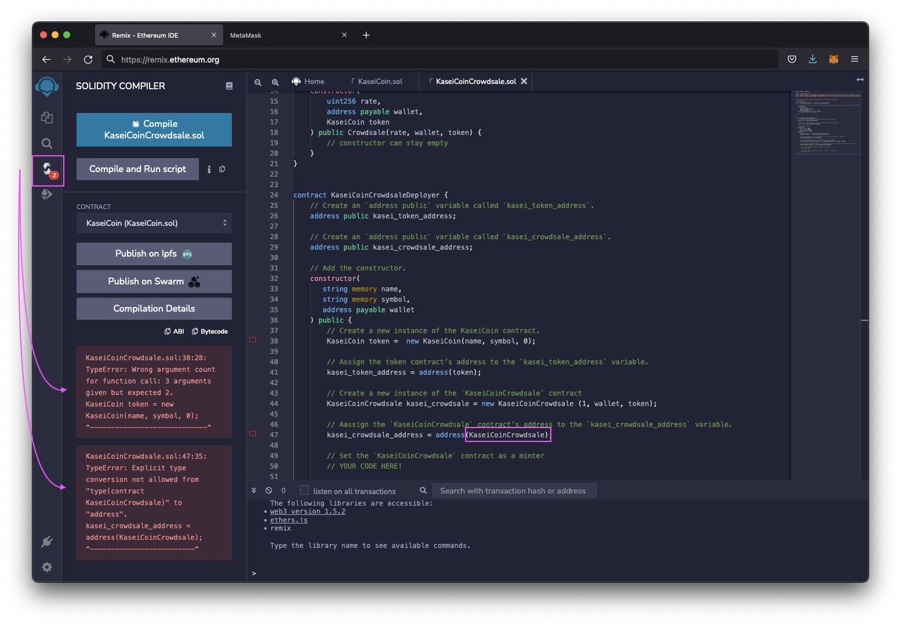
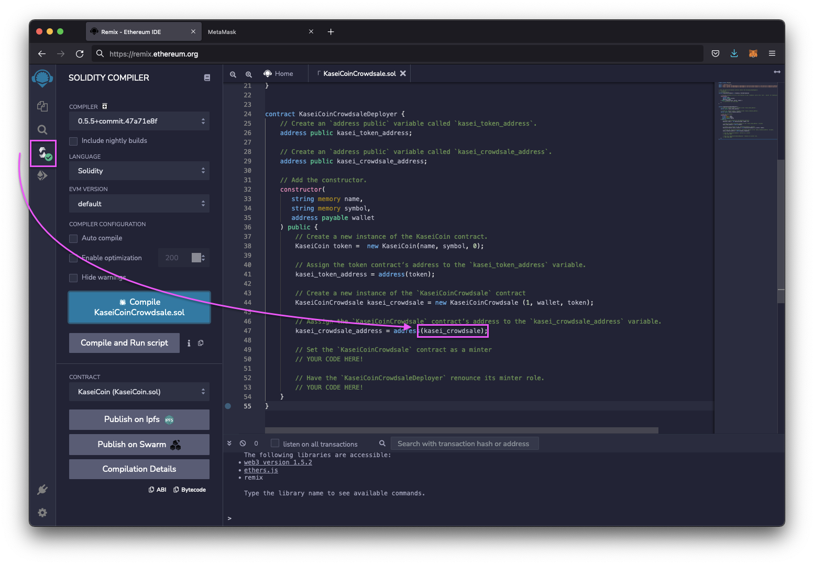

# Unit 21: Martian Token Crowdsale

## Background

After waiting for years and passing several tests, the Martian Aerospace Agency selected a prominent fintech professional to lead a project developing a monetary system for the new Mars colony. Their decision was that the new system be based on blockchain technology and to define a new cryptocurrency named **KaseiCoin**. Kasei after the Japanese word for Mars.

KaseiCoin will be a fungible token that’s ERC-20 compliant. A crowdsale where people moving to Mars can convert their Earth fiat money to KaseiCoin.

## Evaluation Evidence

#### Develop KaseiCoin.sol smart contract that will mint the KAI

KaseiCoin inherits the following contracts from the OpenZeppelin library:

    * `ERC20`  
    * `ERC20Detailed`
    * `ERC20Mintable`

Test compile failed due to `uint initial_supply` being an unsed variable.  
Fig. 1    

To compile with no errors unused var `uint initial_supply` was commented. Screenshot of successful compilation of the Kasei constructor definition contract below.  
Fig. 2    

Test compile of `KaseiCoinCrowdsale.sol` with errors. `KaseiCoin.sol` constructor contract was not in uploaded remix.ethereum.org.  
Fig. 3    

Complie error screenshot due to the above upload omission.  
Fig. 4    

Screenshot of successfulest compile of `KaseiCoinCrowdsale.sol` contract below. 
Fig. 5    

Test compile of `KaseiCoinCrowdsale.sol` with errors. Errors due to commented line in Fig. 2. Expected arugment count of 3. Only 2 due to test compile. Ln 38 was uncommented. Ln 38 was uncommented to attemp compile. 2nd compile error encountered due to Ln. 47. The `KaseiCoinCrowdsale` object was called, should have called the instance named `kasei_crowdsale`.   
Fig. 6    

Reference was changed to `kasei_crowdsale` - Successfull compile Fig. 7.  
Fig. 7    